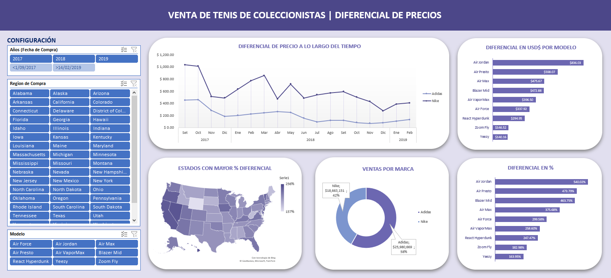

# Dashboard de Diferencial de Precios - Tenis de Coleccionistas (2017-2019)

## Descripción General
Este repositorio contiene un **dashboard interactivo en Excel** para el análisis de diferencial de precios de tenis de coleccionistas durante el período 2017-2019. La herramienta permite visualizar y analizar el comportamiento del mercado de reventa, identificando tendencias por marca, modelo, región de compra y evolución temporal del diferencial entre precio de venta real y precio sugerido.

## Características Principales
- **Configuración de Filtros:** Segmentadores interactivos por **Año de Compra**, **Modelo de Tenis** y **Región de Compra** (50 estados de EE.UU.) para análisis geográfico y temporal.
- **Estados con Mayor % Diferencial:** Visualización de evolución mensual (Set 2017 - Feb 2019) del diferencial porcentual por estado.
- **Ventas por Marca:** Distribución de ventas totales y porcentaje de participación:
  - Adidas: **$25.98M (58%)**
  - Nike: **$18.66M (42%)**
- **Diferencial en US$ por Modelo:** Ranking de modelos por diferencial absoluto en dólares:
  - Air Jordan: **$836.03**
  - Air Presto: **$598.07**
  - Air Max: **$475.67**
- **Diferencial en % por Modelo:** Ranking de modelos por diferencial porcentual:
  - Air Jordan: **540%**
  - Air Presto: **474%**
  - Blazer Mid: **464%**
- **Evolución Temporal:** Análisis mensual del diferencial promedio por marca (Set 2017 - Feb 2019) identificando picos y tendencias.

## Objetivo del Proyecto
Desarrollar una solución de **Business Intelligence para mercado de reventa (Resell Market Analytics)** que permita a coleccionistas, inversores y tiendas especializadas entender el comportamiento de precios, identificar oportunidades de compra/venta y optimizar estrategias de pricing basado en datos históricos de diferenciales.

## Objetivos del Proyecto
- **Consolidación de Datos:** Integrar información de compras con variables clave: fecha compra, marca, modelo, precio real, precio sugerido, fecha lanzamiento, talla, región.
- **Cálculo de Métricas Clave:** Determinar diferencial absoluto (US$) y diferencial porcentual (%) por transacción como indicadores de rentabilidad en reventa.
- **Análisis Multidimensional:** Segmentar por tiempo (mensual), geografía (50 estados), marca (Adidas/Nike) y modelos.
- **Identificación de Patrones:** Detectar modelos con mayor apreciación, regiones con mayor diferencial y estacionalidad del mercado.

## Insights Clave para el Negocio
- **Dominio de Adidas en Ventas:** Adidas (58% vs Nike 42%) lidera en volumen de transacciones a pesar de menor diferencial por modelo **Insight:** Mayor rotación pero menor margen por unidad.
- **Air Jordan es el modelo más rentable:** Lidera tanto en diferencial en dólares ($836 por par) como en porcentaje (540% sobre el precio original). Es el activo más valioso para coleccionistas e inversionistas.
- **Nike domina en márgenes, Adidas en volumen:** Los modelos con mayor diferencial (Air Jordan, Air Presto, Air Max) son todos de Nike. Adidas, en cambio, lidera en ventas totales gracias a Yeezy. Esto indica que Nike es la marca de especialización y Adidas la de mercado masivo en reventa.
- **El diferencial varía según la época del año:**  Los picos más altos ocurren en septiembre y octubre de 2017 ($605 y $540), mientras que hacia diciembre de 2018 el diferencial cae a $131. Esto sugiere que los lanzamientos recientes generan mayor especulación, y con el tiempo los precios se estabilizan.
- **Geografía de Oportunidad:** Hay estados donde la reventa es más rentable, Delaware (256%), Hawái (250%), Nevada (247%) y California (244%) tienen los diferenciales más altos. Son las regiones ideales para enfocar estrategias de compra y venta.
- **Estados de reventa más baja:** Wyoming (157%), Maine (179%) y Virginia Occidental (180%) presentan los diferenciales más bajos. Esto puede deberse a menor demanda de coleccionistas o mercados menos activos en reventa de sneakers.

## Pasos Involucrados
1. **Extracción y Preparación de Datos:** Consolidación de transacciones con variables: Fecha Compra, Marca, Modelo, Precio Real, Precio Sugerido, Fecha Lanzamiento, Talla, Región.
2. **Cálculo de Métricas:** Implementación de columnas calculadas:
   - `Diferencial en Dlls = Precio Real - Precio Sugerido`
   - `% Diferencial = (Precio Real - Precio Sugerido) / Precio Sugerido`
3. **Modelado con Tablas Dinámicas:** Creación de vistas por:
   - Marca (Adidas/Nike)
   - Modelo (Air Jordan, Yeezy, etc.)
   - Región (50 estados)
   - Tiempo (mensual)
4. **Visualización y Dashboard:** Diseño de interfaz con KPIs, rankings de modelos, mapa de calor por estado y evolución temporal con segmentadores interactivos.

## Habilidades Demostradas
- **Análisis de Mercado Secundario (Resell Market Analytics):** Comprensión de dinámicas de oferta/demanda.
- **Excel Avanzado:** Tablas dinámicas, segmentadores, formato condicional, cálculos de diferencial.
- **Business Intelligence:** KPIs de rentabilidad por unidad, análisis geoespacial y temporal.
- **Visualización de Datos:** Rankings, mapas de calor por estado, evolución temporal de diferenciales.

## Funciones y Técnicas Utilizadas
- **Columnas Calculadas:** `Diferencial en Dlls`, `% Diferencial` para métricas de rentabilidad por unidad.
- **Tablas Dinámicas:** Para resumir diferencial promedio por modelo, marca, región y período.
- **Segmentadores:** Filtros interactivos por **Año** y **Región de Compra** para análisis granular.
- **Formato Condicional:** Escalas de color para identificar rápidamente regiones con mayor % diferencial.
- **Gráficos de Barras y Líneas:** Visualización de rankings por modelo y evolución temporal por marca.
- **Mapa de Estados:** Representación geográfica del % diferencial por región.
